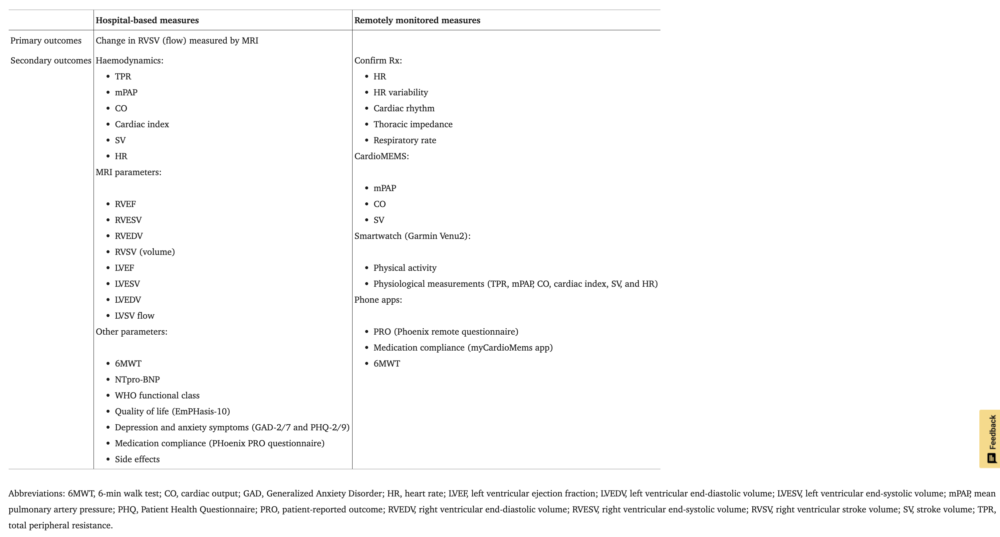

## Dataset from Monitoring Study on Pulmonary Hypertension Patients (1st June 2025)

### Background

**Fit-PH** is patient data derived from _PHoenix_, a Phase IV randomized clinical trial involving patients with pulmonary hypertension (PH). PHoenix participants receive two treatments at two different periods (2 x 2 randomized crossover trial). This design trial is suited for evaluating short-acting treatments in chronic conditions and where each participant serves as their own control.

The trial's primary aim is to compare dose-response effects and clinical efficacy of two medical regimes:
- **Dual treatment**  - riociguat + ERA _or_ 
- **Triple treatment** - selexipag + ERA + PDE5i. 

As part of the study, participants were also implanted with two cardiovascular monitoring devices which enables continuous remote capture of physiological signals. These devices are:
- **CardioMEMS™** - a wireless pulmonary artery sensor
- **ConfirmRx™** - an insertable cardiac rhythm monitor

Trial design suggests participants are to be monitored over a 27 week period. At week 0, patients are randomised to receive for the duration of 11 weeks, either the dual or triple treatment arm.  At weeks 13-15, treatment is stopped to enable a washout. From week 16-27, participants receive the other treatment arm. 

Fit-PH data is used to produce models of personalized treatment-response profiles, by correlating each participant's device-measured physiology with medication dosing and clinical outcomes. Analysis on remote data specifically searches for early signs of therapeutic response -or adverse changes-, to assess the plausibility of enabling timely adjustment strategies.  

In summary, Fit-PH data comprise of PHoenix clinical trial participants' data, who are individuals diagnosed with PH. Participants receive both dual and triple treatments. Multiple outcome measures are collected from each participant, both in hospital settings and remotely. These outcome measures are used to indicate each participant’s physiological response, treatment efficacy, and potential adverse effects, providing insights into the optimal therapy for managing PH.

|  |
|:--:|
| *Figure 1: Summary of PHoenix trial assessments published by Clinical Research & Innovation Office* |

### Data Composition 

#### Background

In March 2025, Turing ingressed a Fit-PH dataset from Sheffield Training Hospital NHS Trust into a Turing Safe Haven Tier 3 environment. The data wrangling team removed some identifying information and egressed a redacted dataset into a Tier 2 environment. 

We refer to this dataset as Fit-PH V1.0 because there will be subsequent datasets updated with new patient records.

Fit-PH V1.0 consists of 17 participants data which can be categorised as follows:

- **Demographic:** (e.g. age, sex) recorded at baseline 
- **Medical History:** (e.g. date of diagnoses, comorbidities) recorded at baseline 
- **Intervention regime:** (e.g. riociguat 5mg daily) Date-stamped records of medication regime, titrations and changes
- **Clinical assessments:** 
    - **Functional test results** (e.g. WHO functional class, 6 minute walk test)
    - **Patient-reported outcomes from questionaires** (e.g. EQ-5D-5L, EmPHasis-10) 
    - **Physiological vital signs** (e.g. resting blood pressure, NT-proBNP)
- **Implant temporal data:** (e.g pulmonary arterial presssure) -- physiological time-series from implantable devices

Data is collected at varying frequencies and time intervals throughout the 27-week duration of the trial. While many data points are categorized by study timeline labels (e.g., Baseline, Follow-up, Week 0–27), some also include exact calendar dates as timestamps.

In order to illustrate this, we used FitPH V1.0 to generate Figure 1 below, highlighting the timing and key data collected. Each row represents a patient’s 27-week participation in the study, with colored segments and markers indicating different data modalities. Continuous bands represent daily remote monitoring from implantable devices (e.g. pulmonary artery pressure, cardiac output, and physical activity), while discrete markers denote in-clinic visits, clinical assessments, and therapeutic interventions. [For example, red circles indicate hospital visits, blue squares indicate questionnaire completions, and yellow triangles represent dose adjustments.] This visualisation illustrates the structured and multimodal nature of the data collected over the study period.

|  |
|:--:|
| *Figure 2: Data collection timeline of key data for PHoenix participants, on the 1st June 2025* |

#### Demographics 

Participants' demographics data points are recorded once at the beginning of the trial. The following statements describe Fit-PHV1.0 demographics variables and values:  
- Prticipants' median age was x years.
- x% were female. 
- Most participants were classified as WHO functional class III, this reflects moderate to severe limitations in physical activity. 
- Index of Multiple Deprivation (IMD) scores show that paticipants were drawn from a range of socioeconomic backgrounds

Figure 2 below is drawn from Fit-PHV1.0 demographics data .

|  |
|:--:|
| *Figure 3: Patient demography key variables, recorded at enrollment* |

Small sample size limits conclusions about potential bias in key demographic variables.
(Say something about missingness).

#### Medical History

Patient medical history is collected once. Medical history includes information such as the time since PAH diagnosis, aetiology of disease, and comorbidities. Names of prior PAH treatments are also recorded. These variables provide clinical context for interpreting treatment response and disease progression across the trial period. 

|  |
|:--:|
| *Figure 3: Patient medical history key variables, recorded at enrollment* |

#### Clinical assessments

Clinical assessments in this trial comprise functional tests, patient-reported outcome measures, and diagnostic investigations. Fit-PHV1.0 consists of an ongoing collection of the following tests:

__PHoenix's functional tests__ assess patients’ physical capacity and symptom burden in the context of pulmonary hypertension. 
- __6-minute walk test (6MWT)__ measures the distance a person can walk on a flat surface in six minutes as an indicator of exercise tolerance, particularly in individuals with cardiovascular or respiratory conditions. Data is collected four times during the trial: at Study Week 0 and 12 when the first treatment starts and ends, and at Study Weeks 17 and 27 when the second arm starts and ends. 

<!-- (Confirm this))In the dataset, there are 6MWT records at the baseline, but not yet for subsequent hospital visits nor self-reports. -->
- __WHO__ functional class is a clinician-assigned rating of symptom severity based on the patient’s physical limitations. The WHO score is collected once, at the beginning of the trial. 

<!-- (Was this actually part of trial??) -->
- __Incremental Shuttle Walk Test (ISWT)__ evaluates exercise capacity through a paced walking protocol that increases in intensity, offering a more structured alternative to 6MWT. This data is not mandatory per trial guidelines and FIT-PHV1.0 shows a high number of missing records.

<!-- Examples of  patient-reported outcome measures (PROMs) are the EmPHasis-10 (E10) and EQ-5D-5L questionnaires, which reflect patients’ perceptions of their symptoms, quality of life, and psychological wellbeing. Examples of diagnostic investigations include blood tests and magnetic resonance imaging. -->

__Diagnostic investigations__ PHoenix trial used imaging and blood biomarkers to evaluate treatment arm outcome.

- __MRI scans__ play a key role in evaluating Phoenix participants by providing accurate, non-invasive measurements of 'right ventricular stroke volume (RVSV)', which is the trial's primary outcome measure. Overall, 72 measurements are recorded during each scan. Each participant undergoes an MRI scan 4 times; these are scheduled to capture primary outcome measures at the beginning and at the end of both treatment arms. The date of each scan is recorded.
- A __blood test__ to monitor changes in the levels of the NTpro-BNP protein help evaluate treatment response. The result of this test is a secondary outcome measure. As with MRI scans, this test is performed 4 times throughout the trial, at the beginnings and ends of each treatment arm. Instead of a measurement date, a study timeline record indicates when the test was taken, during the trial. 

__Patient-reported outcome measures (PROMs)__ capture participants' subjective experience of PH in terms of symptoms, emotional impact, and social functioning. It complements functional tests by providing insight into how pulmonary hypertension affects a patient’s daily life from their own perspective. 

- __EmPHasis-10 (E10)__ questionnaire is a disease-specific PROM to assess quality of life in people with PH. E10 contains 10 equally weighted items. There are two sets of patient E10 scores in Fit_PHV1.0 _(see Known Issues below about administration times and score records)._
<!-- These issues may affect analyses involving patient quality of life.  -->

- __GAD-7__ is a screening tool for generalized anxiety disorder (GAD) with 7 items, each denoting a symptom about anxiety. GAD-2 is a shortened version using only the first two items of the GAD-7. Each item is scored 0-3 based on frequency the symptom is experienced fortnightly. These questionaires are answered fortnightly. 

- __PHQ-9__ is a 9-item, self-administered questionnaire designed to assess the presence and severity of depressive symptoms. Each of the 9 items reflects a symptom of depression and the range for each item is 0-3, with 3 to mean that the patient experiences the symptom "nearly every day." These questionaires are answered fortnightly. 

|  |
|:--:|
| *Figure 3: Sample of participant PROM scores and completeness* |

### Known Issues

This section outlines specific issues observed in Fit-PHV1.0 that may affect data interpretation or analysis, including inconsistent terminology and unverifiable total scores.

`Demographics -> Diagnosis` is stored as free-text entries, resulting in inconsistent use of terminology, abbreviations, and phrasing to describe the same condition. For example, the same diagnosis may appear as "PVOD" or “PVOD**” making direct comparison or grouping across patients challenging. 

`Demographics -> Comorbidities` contains free-text entries with inconsistent structure and variable levels of detail across patients. Clinical terms are abbreviated (e.g., "ILD", “HTN”), but not always standardised, and some records include additional lifestyle or contextual information—such as smoking status, alchohol intake and BMI—while others omit it entirely. This variability introduces challenges for reliable analysis, as comorbidity data may be incomplete, non-comparable, and difficult to categorise systematically without manual review or natural language processing.

`PROMS -> Paper_E10` includes item-level scores, recorded along with date of test and study timeline labels (Baseline, Week 12, 15 and 27). Total scores were recorded directly as single values, rather than being derived from the individual items. This limits the ability to verify the accuracy and some totals appear inconsistent with the expected item-level score, suggesting possible data entry errors. 

`PROMS -> Emphasis_10_tp` include total level score, and values include non-numeric free text entries (e.g."PAUSED", "NOT MISSING DATA"), which will require cleaning or exclusion before analysis. 

`Paper_E10 vs Emphasis_10_tp` The score recorded at Weeks 0, 12, 15 and 27 do not match the scores recorded in `Paper_E10`.

`PROMS -> GAD7` has a high level of missingness in comparison with `PROMS -> GAD2`. This limits the ability to assess anxiety severity using the full scale and restricts analysis about anxiety to screening-level data only. The same is observed of data from PHQ2 and PHQ7.

<!-- The first set is stored in a sheet labelled `Paper_E10`, and it includes item-level scores, recorded along with date of test and study timeline labels (Baseline, Week 12, 15 and 27). Total scores were recorded directly as single values, rather than being derived from the individual items. This limits the ability to verify the accuracy and some totals appear inconsistent with the expected item-level score, suggesting possible data entry errors. 
    The second set is in a sheets labelled `Emphasis_10_tp` which has been transposed as part of dta wrangling process to maintain consistency. It contains total E10 score recorded on a weekly basis. 

Some fields such as diagnosis and comorbidities data were recorded as free-text entries, resulting in inconsistent use of terminology, abbreviations, and phrasing to describe the same condition. For example, the same diagnosis may appear as “PAH”, “pulmonary arterial hypertension”, or “Group 1 PH”, making direct comparison or grouping across patients challenging. This lack of standardisation limits the ability to reliably stratify patients by diagnosis type and may introduce ambiguity in downstream analyses unless additional harmonisation or coding is applied.

In the source data, E10 (EmPHsis-10) total scores were recorded directly as single values, rather than being derived from the individual questionnaire items. This limits the ability to verify the accuracy of the total score, and in some cases, the recorded values appear inconsistent with the expected scoring range (0–50), suggesting possible data entry errors. Without access to the item-level responses, it is not possible to validate or recalculate total scores, which may affect analyses involving quality-of-life measures.

There is greater data completeness for the GAD-2 screening tool compared to the full GAD-7 questionnaire. In many cases, only the first two items were recorded, while responses to the remaining five items required to compute a full GAD-7 score are missing. This limits the ability to assess anxiety severity using the full scale and may introduce bias or restrict analysis to screening-level data only. -->

### Reproducibility of Results

(add titration figure here)

<!-- 
- What entities are being measured (e.g., patients, hospital visits)?
- What are the key variables/columns?
- What is the size and structure (e.g., number of rows, time range, frequency)? (Heatmap?)
- Are there distinct cohorts, subgroups, or timepoints? (put histogram of diagnosis types?)

## Data Collection Context
- Are there known biases in how the data was collected? (histograms? can't do ethnicity, what about sex and age?)

## Data Sensitivity and Privacy
## Data Missingness 
-->

|  |
|:--:|
| *Figure 1: PHOenix Participants' Outcome Measures* |

### References

1. [Pulmonary Hypertension: Intensification and Personalization of Combination Rx (PHoenix): A phase IV randomized trial for the evaluation of dose‐response and clinical efficacy of riociguat and selexipag using implanted technologies ](https://pmc.ncbi.nlm.nih.gov/articles/PMC10945040/)
2. [Remote monitored physiological response to therapeutic escalation and clinical worsening in patients with pulmonary arterial hypertension](https://www.medrxiv.org/content/10.1101/2023.04.27.23289153v2)
3. [Data Dictionaries](https://thealanturininstitute.sharepoint.com/:x:/r/sites/cvdnetshared/_layouts/15/Doc.aspx?sourcedoc=%7B7D68FCD0-6969-4BD6-BE8D-1251DB4CB34C%7D&file=Co-WIP%20Data%20Dictionaries%20(FitPH%20%26%20ASPIRE).xlsx&action=default&mobileredirect=true)

Notes from Mahwish:
All patients visit the clinic on a weekly basis
All the data in the demographic dataset, excluding the last four sheets of questionnaires (Emphasis_10_tp, PHQ_tp, GAD_tp, PHoenix_PRO_tp,) is collected in clinic
The two paper questionnaires in the beginning (Paper EQ5D5L and E10) are collected in clinic (they should coincide with BL, Wk12, Wk 15, Wk 27/Final)
NTproBNP blood tests are also done in clinic, and you've got baseline, week 12, week 15, and week 27 measurements
The 6MWD (6 minute walking distance) test columns: walk_1_BL, walk_1_max, walk_2_BL, walk_2_max - correspond to week 0, week 12, week 15, week 27 roughly for each patient. I.e, when the patient starts and stops each therapy respectively.
ISWT is an 'improvement' of 6MWD which was initiated by Sheffield hospital as an improvement of the 6MWD. 6MWD is mandatory for the patients (as per guidelines), ISWT is not (so you may notice missing data)