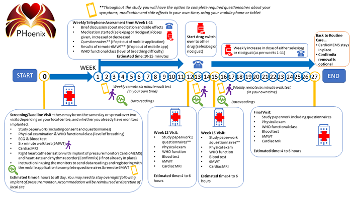
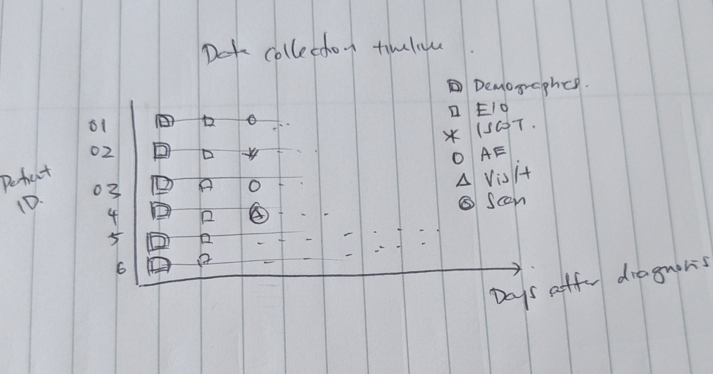
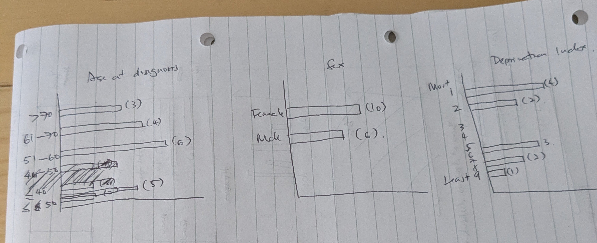
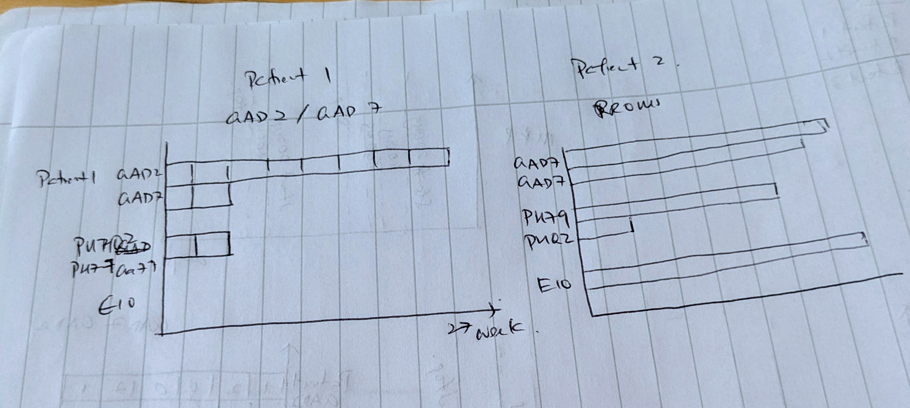

## Dataset from Monitoring Study on Pulmonary Hypertension Patients (1st June 2025)

### Background

**Fit-PH** is a dataset derived from _PHoenix_, a Phase IV randomized clinical trial involving patients with pulmonary hypertension (PH). The trial's primary aim was to assess dose-response effects and clinical efficacy of two medications: **riociguat** and **selexipag**, in addition to standard care. As part of the study, participants were also implanted with cardiovascular monitoring devices, which enables continuous remote capture of physiological signals. 

The dataset is collected with the aim of developing personalized treatment-response profiles, by correlating each individual's device-measured physiology with medication dosing and outcomes. The aim of remote monitoring is to detect early signs of therapeutic response -or adverse changes- to enable timely adjustment strategies. Trial design suggest participants are to be monitored over a 27 week period during which they were required to attend 4 hospital visits. Monitoring of physiological, functional and psychological wellbeing are achieved when patients undergo clinical assessments at clinic, or self-report through questionaires. Additional data is also recorded remotely from home through implantable devices that tracked continuous physiological signals e.g. blood pressure. 

|  |
|:--:|
| *Figure 1: Summary of PHoenix trial assessments published by Clinical Research & Innovation Office* |

### Data Composition

On 1st June 2025, the dataset comprises of 17 individuals diagnosed with PH who enrolled in the clinical trial and were randomised to receive varying doses of riociguat or selexipag. Several types of data are collected from each participant over a 27-week period. The data can be categorised as follows:

- **Demographic:** (e.g. age, sex) recorded at baseline 
- **Medical History:** (e.g. date of diagnoses, comorbidities) recorded at baseline 
- **Intervention regime:** (e.g. riociguat 5mg daily) Date-stamped records of medication regime, titrations and changes
- **Clinical assessments:** 
    - **Functional test results** (e.g. WHO functional class, 6 minute walk test)
    - **Patient-reported outcomes from questionaires** (e.g. EQ-5D-5L, EmPHasis-10) 
    - **Physiological vital signs** (e.g. resting blood pressure, NT-proBNP)
- **Implant temporal data:** (e.g pulmonary arterial presssure) -- physiological time-series from implantable devices

Figure 2 shows the timeline of data collection for each participant in the PHonix trial, highlighting the timing and key data collected. Each row represents a patient’s 29-week participation in the study, with colored segments and markers indicating different data modalities. Continuous bands represent daily remote monitoring from implantable devices (e.g. pulmonary artery pressure, cardiac output, and physical activity), while discrete markers denote in-clinic visits, clinical assessments, and therapeutic interventions. [For example, red circles indicate hospital visits, blue squares indicate questionnaire completions, and yellow triangles represent dose adjustments.] This visualisation illustrates the structured and multimodal nature of the data collected over the study period.

|  |
|:--:|
| *Figure 2: Data collection timeline of key data for PHoenix participants* |

The following sections explains data from data category, provides a population distribution of key variables or a sample of individual data, as well as notes about limitations and completeness. 

#### Demographics 

Participant demographics data are recorded at enrollment. Participants' median age was x years, and x% were female. Most participants were classified as WHO functional class III, reflecting moderate to severe limitations in physical activity. The cohort included patients from a range of socioeconomic backgrounds, and Index of Multiple Deprivation (IMD) scores were recorded to assess deprivation levels. 
|  |
|:--:|
| *Figure 3: Patient demography key variables, recorded at enrollment* |

Small sample size limits conclusions about potential bias in key demographic variables.
(Say something about missingness).

#### Medical History

Patient medical history includes key information such as the time since PAH diagnosis, aetiology of disease, and pre-existing comorbidities. Details of prior PAH treatments are also recorded. These variables provide clinical context for interpreting treatment response and disease progression across the trial period.

|  |
|:--:|
| *Figure 3: Patient medical history key variables, recorded at enrollment* |

The Diagnosis field is recorded as free-text entries, resulting in inconsistent use of terminology, abbreviations, and phrasing to describe the same condition. For example, the same diagnosis may appear as "PVOD" or “PVOD**” making direct comparison or grouping across patients challenging. 

The Comorbidities column contains free-text entries with inconsistent structure and variable levels of detail across patients. Clinical terms are abbreviated (e.g., "ILD", “HTN”), but not always standardised, and some records include additional lifestyle or contextual information—such as smoking status, alchohol intake and BMI—while others omit it entirely. This variability introduces challenges for reliable analysis, as comorbidity data may be incomplete, non-comparable, and difficult to categorise systematically without manual review or natural language processing.

#### Clinical assessment

Clinical assessments in this trial comprise functional tests, patient-reported outcome measures, and diagnostic investigations. An example of a functional test is the World Health Organisation (WHO) functional class, which provide objective measures of disease impact on daily activity. Examples of  patient-reported outcome measures (PROMs) are the EmPHasis-10 (E10) and EQ-5D-5L questionnaires, which reflect patients’ perceptions of their symptoms, quality of life, and psychological wellbeing. Examples of diagnostic investigations include blood tests and imaging.

Clinical assessments were recorded in two settings: during scheduled hospital visits and through self-reporting from home. Hospital-visit data include diagnostic investigations and functional tests conducted by healthcare professionals, while self-reported data consist of functional tests and PROMs.

##### Functional tests

Functional tests in this dataset assess patients’ physical capacity and symptom burden in the context of pulmonary hypertension. 

The __6-minute walk test (6MWT)__ measures the distance a person can walk on a flat surface in six minutes as an indicator of exercise tolerance, particularly in individuals with cardiovascular or respiratory conditions. 

The __WHO__ functional class is a clinician-assigned rating of symptom severity based on the patient’s physical limitations during activity. 

Finally the __Incremental Shuttle Walk Test (ISWT)__ evaluates exercise capacity through a paced walking protocol that increases in intensity, offering a more structured alternative to self-paced walking tests.

##### Patient-reported outcome measures

Patient-reported outcome measures (PROMs) capture patients' subjective experiences in terms of symptoms, emotional impact, and social functioning. It complements functional tests by providing insight into how pulmonary hypertension affects a patient’s daily life from their own perspective. PROMs in this clinical trial include the EmPHasis-10 (E10), the Generalized Anxiety Disorder questionnaires (GAD-7 and GAD-2), and the Patient Health Questionnaire (PHQ-9 and PHQ-2).

The __EmPHasis-10 (E10)__ questionnaire is a disease-specific PROM designed to assess quality of life in people with PH. E10 contains 10 equally weighted items, a higher score indicates greater impairment.

In this dataset, two sets of patient E10 scores were recorded. It is unclear whether patients are duplicated across the two sets, which introduces some uncertainty in intepreting the data.

The first set includes item-level scores, recorded inconsistently during hospital visits at enrollment, weeks 12, 15 and 27. Total scores were recorded directly as single values, rather than being derived from the individual items. This limits the ability to verify the accuracy and sometotals appear inconsistent with the expected item-level score, suggesting possible data entry errors. These issues may affect analyses involving patient quality of life. 

The second set contained total scores recorded on a weekly basis throughout the clinical trial. The dataset includes non-numeric free text entries (e.g."PAUSED", "NOT MISSING DATA"), which will require cleaning or exclusion before analysis.

The __GAD-7__ questionnaire is a screening tool for generalized anxiety disorder (GAD); there are 7 symptoms about anxiety in the questionaire. GAD-2 is a shortened version using only the first two symptoms of the GAD-7. Each symptom is scored 0-3 based on frequency every two weeks.

In this dataset, there is greater data completeness for the GAD-2 screening tool compared to the full GAD-7 questionnaire. In many participants, GAD-7 was submitted for only the first three times, while remaining 11 responses are missing. This limits the ability to assess anxiety severity using the full scale and restricts analysis about anxiety to screening-level data only.

The __PHQ-9__ is a 9-item, self-administered questionnaire designed to assess the presence and severity of depressive symptoms. Each of the 9 items reflects a symptom of depression and the range for each item is 0-3, with 3 to mean that the patient experiences the symptom "nearly every day." The PHQ2, which serves as a rapid screening tool, is a 2-question subset of the PHQ-9.

As with the GAD-7 data, data is recorded every two weeks and there is greater data completeness for the PHQ-2 screening tool compared to the full PHQ-9 questionnaire.

|  |
|:--:|
| *Figure 3: Sample of participant PROM scores and completeness* |

##### Physiological measurements

### Known Issues in the Dataset

This section outlines specific issues observed in the dataset that may affect data interpretation or analysis, including inconsistent terminology and unverifiable total scores.

Some fields such as diagnosis and comorbidities data were recorded as free-text entries, resulting in inconsistent use of terminology, abbreviations, and phrasing to describe the same condition. For example, the same diagnosis may appear as “PAH”, “pulmonary arterial hypertension”, or “Group 1 PH”, making direct comparison or grouping across patients challenging. This lack of standardisation limits the ability to reliably stratify patients by diagnosis type and may introduce ambiguity in downstream analyses unless additional harmonisation or coding is applied.

In the source data, E10 (EmPHsis-10) total scores were recorded directly as single values, rather than being derived from the individual questionnaire items. This limits the ability to verify the accuracy of the total score, and in some cases, the recorded values appear inconsistent with the expected scoring range (0–50), suggesting possible data entry errors. Without access to the item-level responses, it is not possible to validate or recalculate total scores, which may affect analyses involving quality-of-life measures.

There is greater data completeness for the GAD-2 screening tool compared to the full GAD-7 questionnaire. In many cases, only the first two items were recorded, while responses to the remaining five items required to compute a full GAD-7 score are missing. This limits the ability to assess anxiety severity using the full scale and may introduce bias or restrict analysis to screening-level data only.

### Reproducibility of Results

(add titration figure here)

<!-- 
- What entities are being measured (e.g., patients, hospital visits)?
- What are the key variables/columns?
- What is the size and structure (e.g., number of rows, time range, frequency)? (Heatmap?)
- Are there distinct cohorts, subgroups, or timepoints? (put histogram of diagnosis types?)

## Data Collection Context
- Are there known biases in how the data was collected? (histograms? can't do ethnicity, what about sex and age?)

## Data Sensitivity and Privacy
## Data Missingness 
-->

### References

1. [Pulmonary Hypertension: Intensification and Personalization of Combination Rx (PHoenix): A phase IV randomized trial for the evaluation of dose‐response and clinical efficacy of riociguat and selexipag using implanted technologies ](https://pmc.ncbi.nlm.nih.gov/articles/PMC10945040/)
2. [Remote monitored physiological response to therapeutic escalation and clinical worsening in patients with pulmonary arterial hypertension](https://www.medrxiv.org/content/10.1101/2023.04.27.23289153v2)
3. [Data Dictionaries](https://thealanturininstitute.sharepoint.com/:x:/r/sites/cvdnetshared/_layouts/15/Doc.aspx?sourcedoc=%7B7D68FCD0-6969-4BD6-BE8D-1251DB4CB34C%7D&file=Co-WIP%20Data%20Dictionaries%20(FitPH%20%26%20ASPIRE).xlsx&action=default&mobileredirect=true)
