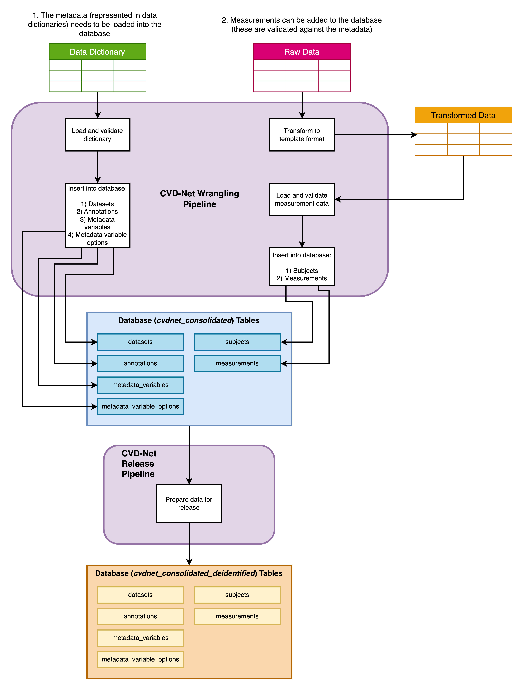

# CVD-Net wrangling pipeline documentation

## Introduction

This documentation is designed to accompany the data wrangling pipeline codebase for CVD-Net. The primary purpose of the pipeline is to take raw data from a number of dataset providers and put the data into a standardised, universal database (known as the 'consolidated database').

A key philosophy behind the pipeline is to also bring the metadata into the database and to ensure that there is a strong link between the two. Furthermore, the pipeline and database design facilitate annotating the data, which should be important for work on knowledge graphs.

This data wrangling work will be done within the Staging TRE (Tier 3). A de-identified version of the database is required for the Insights TRE (Tier 2). The pipeline is also designed to produce this version of the data and make it ready for export to the other environment.

---

## How is de-identification handled?

In the database for fields that contain (or may contain) data that needs de-identifying there are columns with `_deid` appended to the end. For each of these columns the raw column will be dropped and ONLY the de-identified version will make it across to the Insights TRE. Importantly, both columns are retained in the Staging TRE so that the de-identified version can be re-derived if required.

De-identification is handled differently for subject and measurement specific data.

The following subject-specific fields are de-identified in the corresponding ways:
- `subject_identifier` - each subject is assigned a unique, random 10 letter string
- `date_of_birth` - DOB is changed so that day and month are set to '01' (PLANNED - NOT IMPLEMENTED YET)
- `date_of_death` - DOD is changed so that day and month are set to '01' (PLANNED - NOT IMPLEMENTED YET)

In the measurements table when `deidentification_required` is set to 'FALSE' for a variable (in the 'metadata_variables' table), the raw `value` is carried across to the `value_deid` column. When `deidentification_required` is set to 'TRUE' the `value` is programmatically de-identified using the `deidentification_method` (in the 'metadata_variables' table) for the variable (PLANNED - NOT IMPLEMENTED YET) in the `value_deid` column, or left as 'NULL' when a method is not available.

---

## Pipeline structure

The pipeline is structured in a modular manner with separate files for the following things:
- **Annotations** - functions related to the insertion of annotations into the database, and checking existing annotations
- **Database interaction** - high level functions for connecting to the database
- **Datasets** -  functions related to the insertion of datasets into the database, and checking existing datasets
- **Measurements** - functions related to the insertion of measurements into the database, and checking existing measurements. This also includes functions for loading measurement files prior to insertion.
- **Metadata** - functions related to the insertion of metadata (from data dictionaries) into the database, and checking existing metadata. This also includes functions for loading data dictionary files prior to insertion.
- **Subjects** - functions related to the insertion of subjects into the database, and checking existing subjects.
- **Transforming raw data** - functions for transforming raw data into the template format.

---

## Templates

These template files are used by the pipeline to make sure that data passed to the pipeline is as expected. Note that only two of these templates should be needed by the user when inserting the data (the others are used by the system).

### User templates

#### Dictionary (Metadata)

One variable per row, BUT when variable options are present there should be one variable option per row (i.e. the variable will appear on multiple rows - the pipeline knows how to handle this)

Columns:
- **`dataset_name`** - there should only be one variables from one dataset in a file
- **`variable_name`**
- `variable_description`
- **`data_type`** - should be from ['str', 'int', 'date', 'boolean', 'float']
- `unit`
- `associated_visit` - e.g. 'baseline', 'follow-up'
- `category_level_1` - highest level category for annotation
- `category_level_2` - a subcategory of level 1; should only be populated if level 1 is populated
- **`has_options`** - ['0' = No, '1' = Yes]
- `range_min` - should only be populated for 'int' or 'float' data
- `range_max` - should only be populated for 'int' or 'float' data
- **`deidentification_required`** - ['0' = No, '1' = Yes]
- `deidentification_method` - a method to deidentify the data (not currently implemented)
- **`variable_source`** - ['ORIGINAL' = provided in raw data, 'DERIVED' = variable created by us]
- `option_name`
- `option_description` - must be present when an `option_name` is specified

Fields in bold must be populated for each row.

#### Measurement data

Columns:
- **`dataset_name`** - there should only be one variables from one dataset in a file
- **`subject_identifier`** - the identifier for a subject, as provided by the dataset provider
- `gender` - ['M', 'F']
- `date_of_birth` - formatted 'YYYY-MM-DD'
- `date_of_death` - formatted 'YYYY-MM-DD'
- `ethnicity`
- `measurement_date` - formatted 'YYYY-MM-DD'
- `measurement_time` - formatted 'HH:MM:SS' as 24hr clock (seconds can also be decimals e.g. '14:36:12.62742')
- `visit_grouping` - if varables are from the same visit group (e.g. 'baseline', 'week1')
- **`variable_name`**
- `value` - can be empty for NULL values

Fields in bold must be populated for each row.

### System templates

#### Annotations

Columns:
- `category_level_1`
- `category_level_2`

#### Subjects

Columns:
- `dataset_name`
- `subject_identifier`
- `gender`
- `date_of_birth`
- `date_of_death`
- `ethnicity`

---

## Running the pipeline

Running `main.py` will load the full pipeline and setup an engine for connecting to the database. This step will need to be run before attempting to run any other part of the pipeline.

The following diagram shows the different parts of the pipeline and how they should be run. The sections below details how to run these parts and what is happening at each stage.

The [tutorial notebook](../tutorial.ipynb) gives a full run through of the pipeline from start to finish using dummy data. It is recommended to run through this prior to running the pipeline.

### Setting everything up

Before the actual pipeline can be run, you will need to have setup the following (check the [tutorial notebook](../tutorial.ipynb) for more details):
- Set up Python and ensure that the prequisites('sqlalchemy', 'pandas', 'ipykernel', 'psycopg2', and 'openpyxl') are installed.
- Run the [schema file](../CVD-net_consolidated_DDL.sql) to setup the database.
- (This step might be needed) Amend the `database_interaction.connect_database` function with the credentials/config of the database

### Loading and inserting data dictionaries 
> Section 1, left side of diagram

**Prerequisites**
You have a data dictionary file for the dataset and the data dictionary has been already put in the template format (matching `dictionary_template.csv`)

**What will it change?**
Running this function will cause data to be inserted into the following parts of the database:
- **Datasets** - new dataset name (e.g. ASPIRE) inserted if it does not already exist.
- **Annotations** - new sets of annotations (e.g. categories such as 'diagnoses', 'Sensor data') will be inserted if they do not already exist.
- **Metadata variables** - new variables will be added to the database if they do not already exist
- **Metadata variable options** - new variable options will be added to the database if they do not already exist

**What is happening in the background?**
1. A dictionary file in the template format is loaded, and the file is validated. If there are any issues with the file an exception will be raised with details of the issue
2. If the dataset is not present in the 'datasets' table it will be inserted
3. A dataframe of all new annotations will be prepared and these will be inserted into the 'annotations' table.
4. It will check if any variables already exist in the 'metadata_variables' table and insert new ones.
5. If any of the variables have options, then any new ones will be inserted into the 'metadata_variable_options' table.

**How to run it**
1. Run the function `metadata.load_dictionary_file` to load a data dictionary before inserting.
2. Run `metadata.insert_variables` to insert the data into the database.

### Transforming raw data
> Section 2, right side of diagram

**Prerequisites**
You have a raw data file that you want to insert into the database. You should have created a function in `transform_raw_data.py` for the file type (if it does not already exist).

**What will it change?**
The raw data will not be edited. You will generate a separate file of the transformed data.

**What is happening in the background?**
1. Using the specific function for the raw data file the data will be reshaped to align with the structure of the template. This will often involve pivoting the data from wide to long format.

**How to run it**
1. Run the relevant function for the raw file/dataset from `transform_raw_data` to generate transformed data.

### Loading and inserting measurements
> Section 2, right side of diagram

**Prerequisites**
You have already transformed your raw data into the template format. You should have already inserted all the variables in the file into the database using a data dictionary.

**What will it change?**
Running this function will cause data to be inserted into the following parts of the database:
- Subjects - new subjects will be added to the database if they do not already exist
- Measurements - new measurements will be added to the database if they do not already exist.

**What is happening in the background?**
1. A transformed measurement file is loaded and validated to ensure it is formatted as expected. You may need to edit your transformation function from the previous step if there are issues.
2. It will check to see if the dataset exists in the 'datasets' table.
3. Any new subjects not already found in the 'subjects' table will be inserted.
4. It will check whether each variable exists in the 'metadata_variables' table.
5. Information about all the variables with measurements to be inserted will be pulled from the database and each measurement will be validated against the metadata for the variable.
6. Deidentification of the values will be applied (PLANNED - NOT IMPLEMENTED YET)
7. Additional validation and quality checks (e.g. check that measurement occurred after DOB and before DOD)
8. Check whether a value already exists in the database for a dataset/subject/variable combination
9. Insert the measurements

Note that this part of the pipeline can be a little slow to run due to the number of checks and lots of querying of the database.

**How to run it**
1. Run `measurements.load_measurement_file` to load a transformed data file ready for insertion.
2. Run `measurements.insert_measurements` to insert the data into the database.

---

## 'Prepare data for release' (export to the Insights TRE)

To prepare the database for export to the Insights TRE, the separate de-identified version of the database will need to be created. A [script](../prepare_deidentified_database.sh) has been developed to demonstrate this functionality.

The script creates a separate schema dumped to a `.sql` file that can then be ingressed into the Insights TRE and loaded into the database within that TRE.

---

## What is the pipeline missing?

Hopefully most of the functionality that is required to get the pipeline running is already implemented, but there are some things that are still needed:
- De-identification of DOB and DOD in `subjects.insert_subjects` needs implementing (possibly setting day and month to '01')
- The de-identification methods for the values needs implementing (there is a placeholder where this is needed in `measurements.insert_measurements`)
- Check that the de-identification strategy is considering *combinations of variables* e.g. can you infer DOB if you have age at diagnosis and date of diagnosis?
- The de-identification strategy that has been drafted so far is based on the tabular data from ASPIRE and FIT-PH. Wearables and imaging (if being brought into the Turing TRE in raw form - TBC) would need a different strategy. 
- Currently the pipeline can only do inserts - there are no functions to update data (e.g. add extra subject information such as a DOD that we receive in a later transfer, correcting an erroneous measurement). This functionality may or may not be needed!
- It might be useful to have a new table for linking other data (e.g. MRIs) to the data in the database.
- See bottom of `main.py` for more.
- More validation checks when *inserted into* database? Most of these validations checks are done prior. 

---